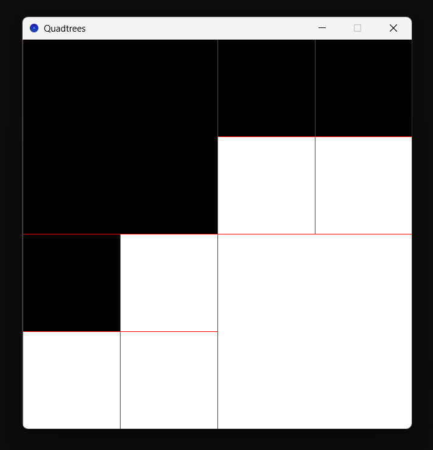

<center>

# Quatrees version 0

*par REDOR Ewan et PACCINI Mathys*

</center>

## I. Fonctionnalités.

L'application permet d'effectuer toutes les fonctionnalités d'une version 0.

### A. <u>Structure du projet et quadtrees.</u>

Le fichier `main.scala` correspond au côté utilisateur.

Le fichier `application.scala` correspond au fichier principal de l'application de manipulation d'images. C'est dans celui-ci qu'est défini l'Univers.

Le fichier `quadtrees.scala` contient la création du type algébrique `QT` représentant les quadtrees, ainsi que des fonctions en lien avec ce type. Le type `QT` est définit comme étant :

- soit `C(c: Color)`, une feuille contenant une seule valeur : sa couleur, représentée par le type `Color` de Scribble.
- soit `N(no: QT, ne: QT, se: QT, so: QT)`, un noeud interne possédant 4 sous-quadtrees où chacun représente un quart de zone.

### B. <u>Lancement et arrêt.</u>

A la création de l'Univers, l'utilisateur doit spécifier :

- le quadtree a visualiser.
- l'ordre de la taille de l'image, correspondant à la puissance $n$ telle que l'image sera de longueur et de largeur $2^n$.

Ci-dessous, un exemple minimal de création d'Univers via l'application.

```scala
/* Exemple de création d'univers
   Ici, l'image sera un carré blanc de longueur 512. */
val quadtree: QT = C(WHITE)
val size_order: Int = 9
bigbang(Application(quadtree, size_order))
```

Appuyer sur la touche `x` stoppe l'application.

### C. <u>Grille de subdivisions.</u>

Appuyer sur la touche `g` affiche et cache (selon le mode courant) la grille des subdivisions successives en quarts. Cette grille correspondant à un contour rouge (couleur `RED` de Scribble) autour de toutes les formes dessinées.



<center>

*Figure 1 : image d'un quadtree où la grille des subdivisions est visible.*

</center>

<br>

## II. Développement du projet.

### A. <u>Avancement.</u>

Toutes les fonctionnalités demandées pour la version 0 ont été implémentées. Des tests ont également été implémentés pour vérifier la validité des fonctions au coeur du code.

### B. <u>Difficultés.</u>

Aucune difficulté particulière n'a été rencontrée.

