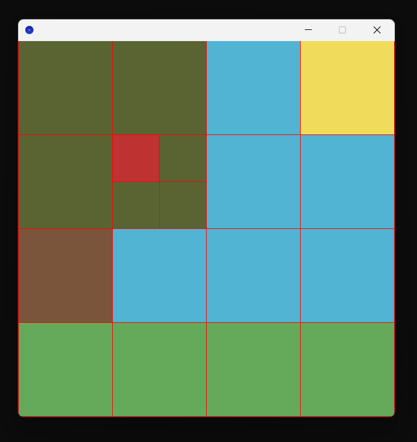

<center>

# Quatrees version 1

*par REDOR Ewan et PACCINI Mathys*

</center>

## I. Structure du projet.

### 1. L'interface.

Le fichier `Quadtrees.scala` correspond à l'interface de notre projet Quadtrees. Il contient la définition du type algébrique `QT` représentant les quadtrees, définit comme étant :

- soit `C(c: Color)`, une feuille contenant une seule valeur : sa couleur, représentée par le type `Color` de Scribble.
- soit `N(no: QT, ne: QT, se: QT, so: QT)`, un noeud interne possédant 4 sous-quadtrees où chacun représente un quart de zone.

```scala
sealed trait QT
case class C(c: Color) extends QT
case class N(no: QT, ne: QT, se: QT, so: QT) extends QT
```

L'interface contient les fonctionnalités suivantes (voir le fichier source pour les spécifications complètes) :

```scala
trait IntQuadtrees {

  // Manipulation de Quadtrees.

  def quadtree_to_image(qt: QT, grid: Boolean, size_order: Int): Image
  def compress(qt: QT): QT

  // Transformations prédéfinies par l'interface.

  def rotation_left(qt: QT): QT
  def rotation_right(qt: QT): QT

  def flip_vertical(qt: QT): QT
  def flip_horizontal(qt: QT): QT

  def gray_shades(qt: QT): QT
  def lighten(qt: QT): QT
  def darken(qt: QT): QT

  // Transformation de Quadtrees.

  def transform(qt: QT, fs: List[Transformation]): QT

}
```

### 2. L'implémentation.

Le fichier `ImpQuadtrees.scala` implémente l'interface décrite dans la section précédente, et ce grâce à une décomposition fonctionnelle.

### 3. L'utilisation.

Le fichier `Main.scala` correspond au côté utilisateur. Il est lié à un fichier auxiliaire `Templates.scala` contenant spécifiquement des quadtrees prédéfinis pouvant être utilisés.


## II. Fonctionnalités.

### 1. <u>Conversion d'un quadtree en image.</u>

Utiliser la fonction `quadtree_to_imag` nécessite de donner en paramètre :

- `quadtree` le quadtree a visualiser.
- `grid` un booléen spécifiant si on affiche la grille des subdivisions (`true`) ou non (`false`).
- `size_order` l'ordre de la taille de l'image, correspondant à la puissance $n$ telle que l'image sera de longueur et de largeur $2^n$.

Ci-dessous, un exemple minimal de création d'Univers via l'interface.

```scala
/* Exemple de création d'image dans Main.scala. */

val service_QT: Quadtrees = ???

val quadtree: QT = quadtree_plain // Templates.scala
val grid: Boolean = false
val size_order: Int = 9 // 512 x 512

val image: Image = service_QT.quadtree_to_image(quadtree, grid, size_order)

draw(image)
```

On obtient alors l'affichage suivant au lancement.


<div style="text-align: center">

*Figure 1: affichage de l'image représentée par le quadtree `quadtree_plain`.*
</div>

### 2. <u>Grille de subdivisions.</u>

Paramétrer `grid` comme valant `true` (resp. `false`) affiche (resp. cache) la grille des subdivisions successives en quarts. Cette grille correspondant à un contour rouge (couleur `RED` de Scribble) autour de toutes les formes dessinées.



<center>

*Figure 2: affichage de l'image représentée par le quardtree `quadtree_plain` où les traits de subdivisions sont visibles.*

</center>

<br>

### 3. <u>Compression.</u>

La fonction `compress` permet de compresser un `quadtree`, c'est-à-dire que le `quadtree` renvoyé est visuellement identique, mais ne possède aucun noeud dont tous ses enfants sont des feuilles de même couleur.

### 4. <u>Transformations.</u>

L'interface propose quelques transformations d'images :

- **rotation** (gauche, droite) : fonctions `rotation_left` et `rotation_right`.

- **mirroir** (vertical, horizontal) : fonctions `flip_vertical` et `flip_horizontal`.

- **couleurs** (éclaircir, noircir, mettre en nuances de gris) : fonctions `lighten`, `darken` et `gray_shades`.

La fonction `transforms` permet de combiner ces transformations, en prenant en entrée une liste de transformations et en les appliquant une par une, de la tête à la queue.

Par exemple, en appliquant à `quadtree_plain` une rotation de 90° à gauche, puis un volte-face vertical, et enfin en l'éclairant 3 fois...

```scala
val transfos = service_QT.rotation_left
            :: service_QT.flip_vertical
            :: service_QT.lighten
            :: service_QT.lighten
            :: service_QT.lighten
            :: Nil
  
service_QT.transform(quadtree, transfos)

val qt: QT = my_transformation(quadtree)

val image = service_QT.quadtree_to_image(qt, grid, size_order)

draw(image)
```

...on obtient le résultat suivant.


*Figure 3: affichage de l'image représentée par `quadtree_plain` après plusieurs transformations.*

Une transformation étant de type `QT => QT`, l'utilisateur peut tout à fait créer et utiliser ses propres transformations. Le fichier `Main.scala` en contient un exemple avec la fonction `color_chaos`.

## III. Développement du projet.

### 1. <u>Avancement.</u>

Toutes les fonctionnalités demandées pour la version 1 ont été implémentées.

Des fonctionnalités supplémentaires ont également été ajoutées, comme la fonction `transforms`.

Des tests ont également été implémentés pour vérifier que les fonctions de l'implémentation sont correctes.

### 2. <u>Difficultés.</u>

Nous avons dû restructurer une partie de notre implémentation lors de la fonction `transforms`. En effet, notre choix initial ne permettait pas de mettre à la chaîne des transformations. La version actuelle le permet, et est d'ailleurs plus simple.

