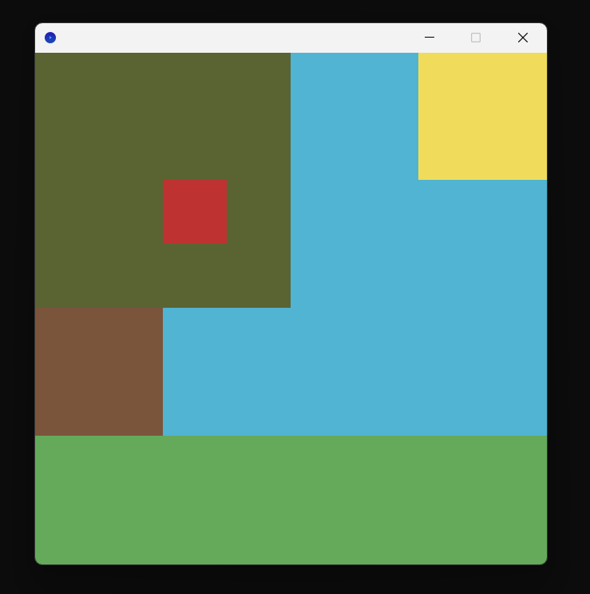
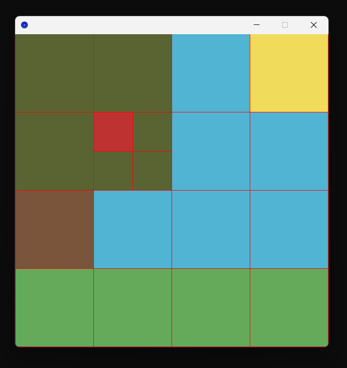
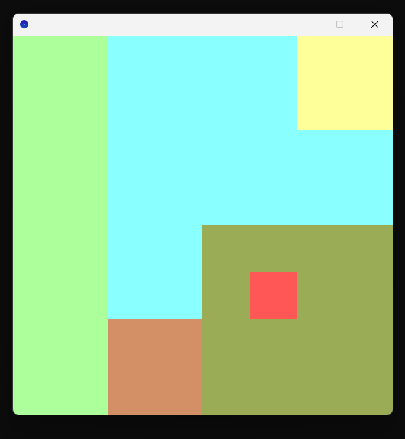
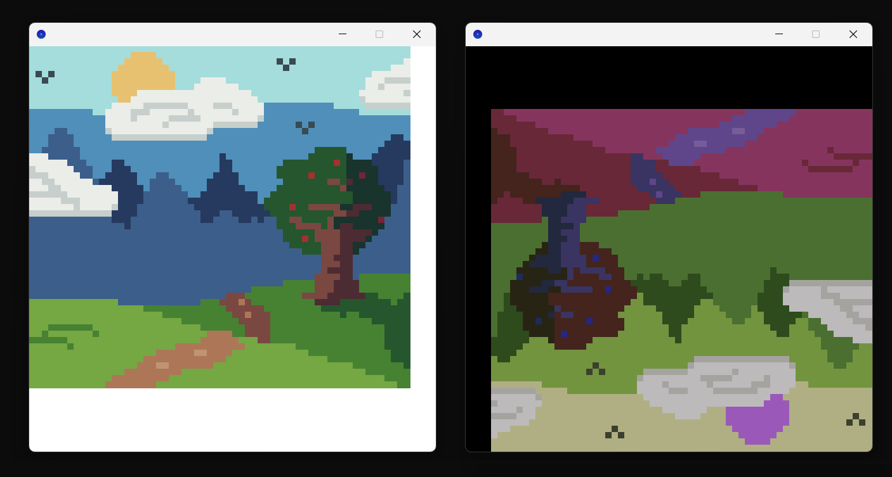

<center>

# Quatrees version 2

*par REDOR Ewan et PACCINI Mathys*

</center>

## I. Développement.

### 1. <u>Avancement.</u>

Toutes les fonctionnalités demandées pour la version 2 ont été implémentées.

Les fonctionnalités supplémentaires sont les suivantes :

- la fonction `transforms`, qui permet d'appliquer une liste de transformations à une image.

- la seconde implémentation de matrices `ImpMatricesVector`, qui permet de gagner en rapidité, puisque la lecture de valeur est constante (et non linéaire comme avec les listes).

Des tests ont également été implémentés afin de vérifier que les différentes fonctions programmées soient fonctionnelles.

### 2. <u>Difficultés.</u>

**Version 1.**

Nous avons dû restructurer une partie de notre implémentation lors de la fonction `transforms`. En effet, notre choix initial ne permettait pas de mettre à la chaîne des transformations. La version actuelle le permet, et est d'ailleurs plus simple.

**Version 2.**

La décomposition fonctionnelle a été un challenge, et sans avoir rencontré de murs, cela a pris un certain temps et un *debugging* plus en profondeur. Les différents tests ont cependant permis de rapidement localiser les erreurs et les corriger.

## II. Structure.

Ci-dessous, la structure générale du projet est présentée.

### 1. L'interface.

Le fichier `Quadtrees.scala` correspond à l'interface de notre projet Quadtrees. Il contient la définition du type algébrique `QT` représentant les quadtrees, définit comme étant :

- soit `C(c: Color)`, une feuille contenant une seule valeur : sa couleur, représentée par le type `Color` de Scribble.
- soit `N(no: QT, ne: QT, se: QT, so: QT)`, un noeud interne possédant 4 sous-quadtrees où chacun représente un quart de zone.

```scala
sealed trait QT
case class C(c: Color) extends QT
case class N(no: QT, ne: QT, se: QT, so: QT) extends QT
```

L'interface contient les fonctionnalités suivantes (voir le fichier source pour les spécifications complètes) :

```scala
trait Quadtrees {

  // Manipulation de Quadtrees.

  def quadtree_to_image(qt: QT, grid: Boolean, size_order: Int): Image
  def compress(qt: QT): QT

  // Transformations prédéfinies par l'interface.

  def rotation_left(qt: QT): QT
  def rotation_right(qt: QT): QT

  def flip_vertical(qt: QT): QT
  def flip_horizontal(qt: QT): QT

  def gray_shades(qt: QT): QT
  def lighten(qt: QT): QT
  def darken(qt: QT): QT

  // Transformation de Quadtrees.

  def transform(qt: QT, fs: List[Transformation]): QT

  // Charger une image depuis un fichier.

  def file_to_quadtree(filename: String): QT

}
```

### 2. L'implémentation.

Le fichier `ImpQuadtrees.scala` implémente l'interface décrite dans la section précédente, et ce grâce à une décomposition fonctionnelle.

En particulier, l'implémentation de la fonction `file_to_quadtree` a nécessité la création d'une autre interface, `Matrices`, donnée sans spécification ci-dessous.

```scala
trait Matrices {

  type T[Elt]

  // Méthodes élémentaires.

  def init_matrix[Elt](n: Int, p: Int, e: Elt): T[Elt]
  def get_dimensions[Elt](m: T[Elt]): (Int, Int)
  def get_element[Elt](m: T[Elt], i: Int, j: Int): Option[Elt]
  def set_element[Elt](m: T[Elt], i: Int, j: Int, e: Elt): T[Elt]

  // Conversions utiles.

  def list_to_matrix[Elt](lines: List[List[Elt]]): Option[T[Elt]]
  def matrix_to_list[Elt](m: T[Elt]): List[Elt]
  def matrix_to_square[Elt](m: T[Elt], e: Elt): T[Elt]

}
```

Cette interface a été implémentée de deux manières différentes.

- l'implémentation `ImpMatricesList` représente une matrice comme une liste de listes.

- l'implémentation `ImpMatricesVector` représente une matrice comme un vecteur de vecteurs. Cela a le bénéfice d'avoir un coût constant sur la lecture des éléments de la matrice.

Enfin, l'objet `MatrixConversions` permet de faire le lien entre image, matrice et quadtree. En effet, celui-ci contient les fonctions `image_to_matrix` et `matrix_to_quadtree`.

### 3. L'utilisation.

Le fichier `ProgrammeUtilisateur.scala` correspond au côté utilisateur. Quelques fonctions en lien avec les fonctions sont programmées afin d'illustrer l'utilisation de la fonction `transforms` de l'interface `Quadtrees`.

Un fichier auxiliaire `Templates.scala` est également présent, contenant des quadtrees prédéfinis pouvant être utilisés par l'utilisateur.


## III. Fonctionnalités.

### 1. <u>Conversion d'un quadtree en image.</u>

Utiliser la fonction `quadtree_to_image` nécessite de donner en paramètre :

- `quadtree` le quadtree a visualiser.
- `grid` un booléen spécifiant si on affiche la grille des subdivisions (`true`) ou non (`false`).
- `size_order` l'ordre de la taille de l'image, correspondant à la puissance $n$ telle que l'image sera de longueur et de largeur $2^n$.

Ci-dessous, un exemple minimal de création d'Univers via l'interface.

```scala
/* Exemple de création d'image dans ProgrammeUtilisateur.scala. */

val service_QT: Quadtrees = ???

val quadtree: QT = quadtree_plain // Templates.scala
val grid: Boolean = false
val size_order: Int = 9 // 512 x 512

val image: Image = service_QT.quadtree_to_image(quadtree, grid, size_order)

draw(image)
```

On obtient alors l'affichage suivant au lancement.



<div style="text-align: center">

*Figure 1: affichage de l'image représentée par le quadtree `quadtree_plain`.*
</div>

### 2. <u>Grille de subdivisions.</u>

Paramétrer `grid` comme valant `true` (resp. `false`) affiche (resp. cache) la grille des subdivisions successives en quarts. Cette grille correspondant à un contour rouge (couleur `RED` de Scribble) autour de toutes les formes dessinées.



<center>

*Figure 2: affichage de l'image représentée par le quardtree `quadtree_plain` où les traits de subdivisions sont visibles.*

</center>

<br>

### 3. <u>Compression.</u>

La fonction `compress` permet de compresser un `quadtree`, c'est-à-dire que le `quadtree` renvoyé est visuellement identique, mais ne possède aucun noeud dont tous ses enfants sont des feuilles de même couleur.

### 4. <u>Transformations.</u>

L'interface propose quelques transformations d'images :

- **rotation** (gauche, droite) : fonctions `rotation_left` et `rotation_right`.

- **mirroir** (vertical, horizontal) : fonctions `flip_vertical` et `flip_horizontal`.

- **couleurs** (éclaircir, noircir, mettre en nuances de gris) : fonctions `lighten`, `darken` et `gray_shades`.

La fonction `transforms` permet de combiner ces transformations, en prenant en entrée une liste de transformations et en les appliquant une par une, de la tête à la queue.

Par exemple, en appliquant à `quadtree_plain` une rotation de 90° à gauche, puis un volte-face vertical, et enfin en l'éclairant 3 fois...

```scala
val transfos = service_QT.rotation_left
            :: service_QT.flip_vertical
            :: service_QT.lighten
            :: service_QT.lighten
            :: service_QT.lighten
            :: Nil
  
service_QT.transform(quadtree, transfos)

val qt: QT = my_transformation(quadtree)

val image = service_QT.quadtree_to_image(qt, grid, size_order)

draw(image)
```

...on obtient le résultat suivant.



*Figure 3: affichage de l'image représentée par `quadtree_plain` après plusieurs transformations.*

Une transformation étant de type `QT => QT`, l'utilisateur peut tout à fait créer et utiliser ses propres transformations. Le fichier `ProgrammeUtilisateur.scala` en contient un exemple avec la fonction `color_chaos`.

### 5. <u>Charger une image depuis un fichier.</u>

La fonction `file_to_quadtree` prend en entrée un fichier image (`.png` ou `.jpg`) selon son chemin relatif au projet, et renvoie le quadtree associé à cette image.

Cela permet notamment d'appliquer les fonctions de transformation à l'image.



<div style="text-align: center">

*Figure 4: A gauche, une image chargée à partir d'une fichier image. A droite, cette même image après diffèrentes transformations, dont certaines programmées par l'utilisateur.*

</div>