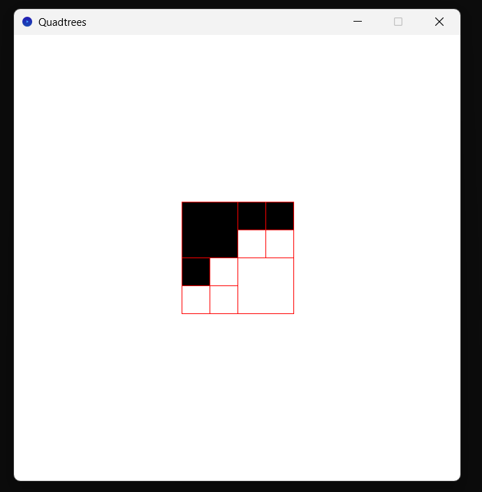

# Quatrees version 0

*par REDOR Ewan et PACCINI Mathys*

## I. Fonctionnalités.

L'application permet d'effectuer toutes les fonctionnalités d'une version 0.

### A. <u>Quadtrees.</u>

L'image affichée est représentée dans le code par le quadtree `DEFAULT_QUADTREE`. Il est de type `QT` (QuadTree), défini comme étant :

- soit `C(c: Color)`, une feuille représentant une couleur.
- soit `N(no: QT, ne: QT, se: QT, so: QT)`, un noeud interne sans couleur déterminée, possédant 4 sous-quadtrees où chacun représente un quart de zone.

### B. <u>Grille de subdivisions.</u>

Appuyer sur la touche `g` affiche ou cache la grille des subdivisions successives en quarts. Cette grille correspondant à un contour rouge (couleur `RED` de Scribble) autour de toutes les formes dessinées.

*Figure 1 : grille de subdivisions affichée.*

 

### C. <u>Dimensions de l'image.</u>

Appuyer sur les touches `+` (resp. `-`) multiple (resp. divise) par 2 les dimensions de l'image produite.

*Figure 2 : dézoome d'un facteur 4 de l'image produite.*

 

### D. <u>Arrêt de l'application.</u>

Appuyer sur la touche `x` stoppe l'application.

## II. Avancement et difficultés.

Toutes les fonctionnalités demandées pour la version 0 ont été implémentées.

Aucune difficulté particulière n'a été rencontrée.

