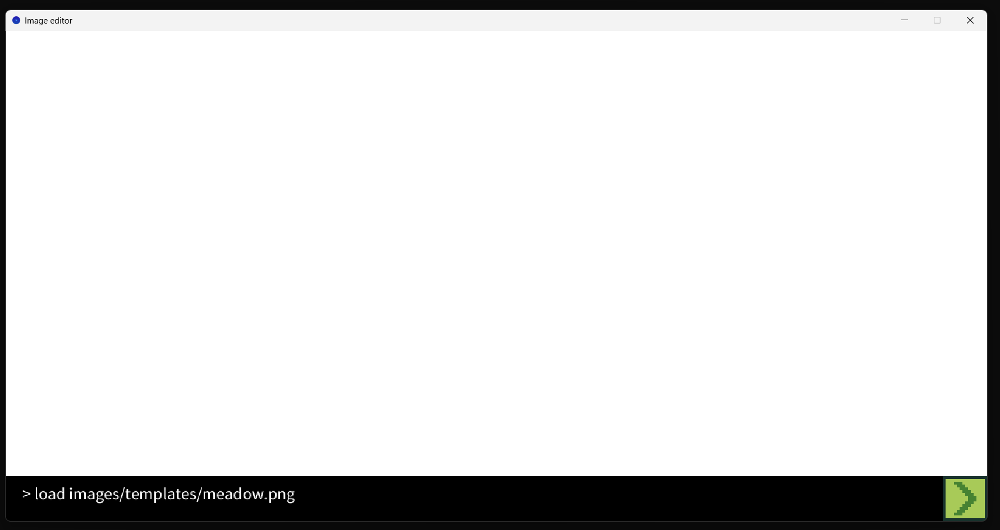
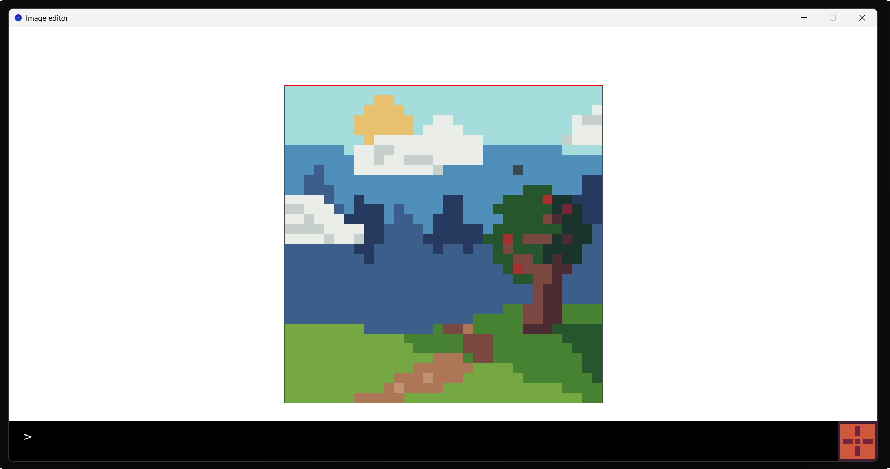
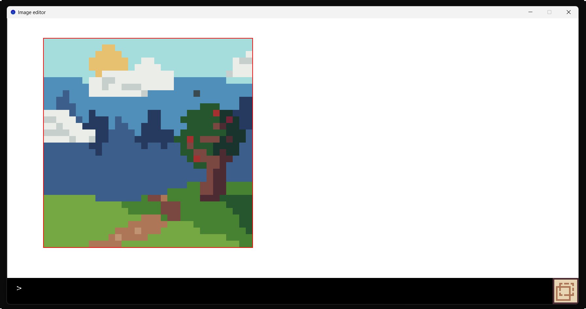
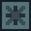
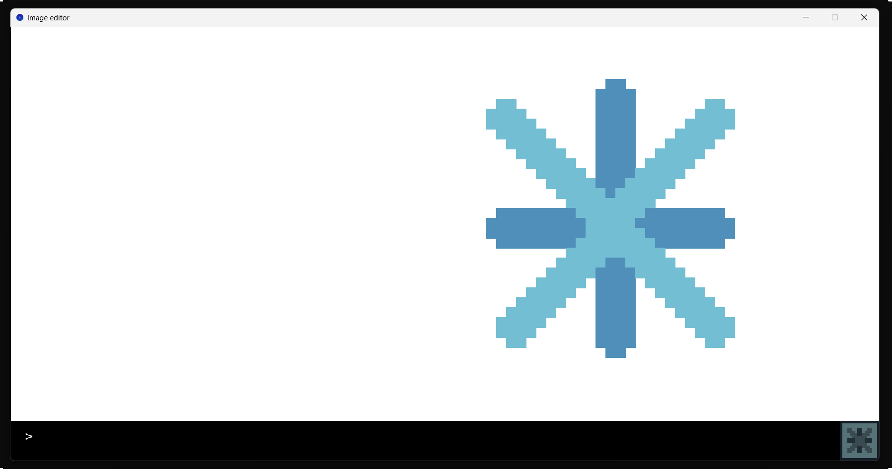
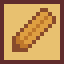
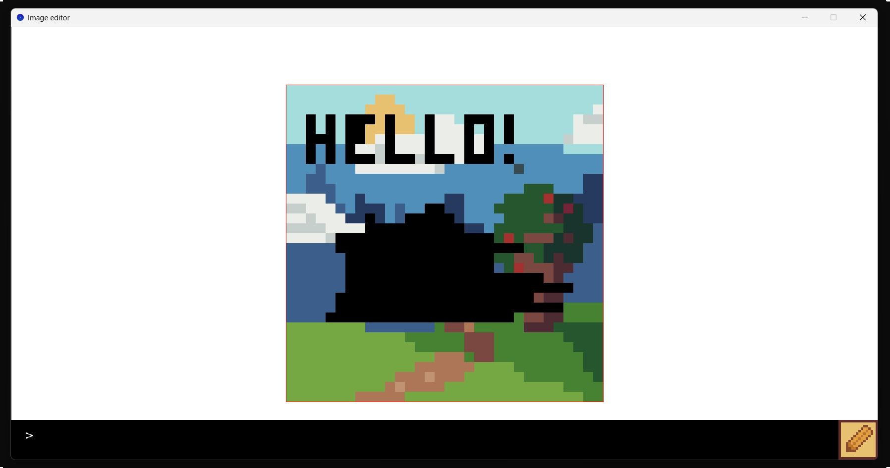
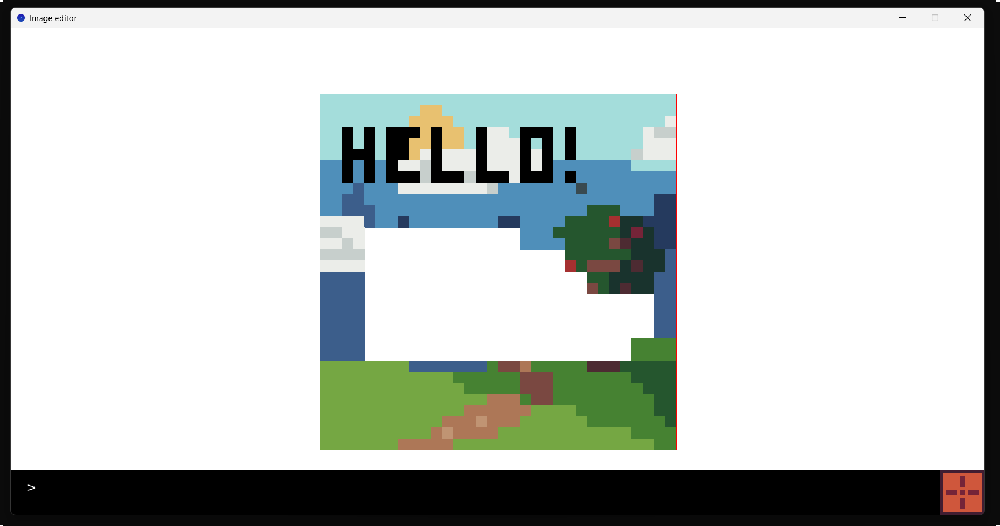
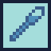
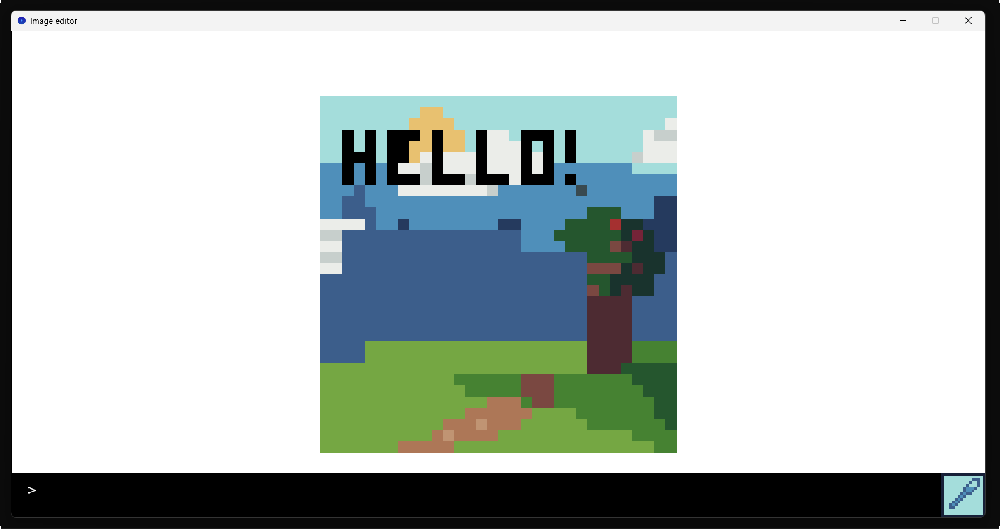

# Quatrees version 3

*par REDOR Ewan et PACCINI Mathys*

## I. Développement.

### 1. <u>Avancement.</u>

Toutes les fonctionnalités demandées pour chaque version ont été implémentées.

Des tests ont également été implémentés afin de vérifier que les différentes fonctions programmées soient fonctionnelles.

### 1. <u>Fonctionnalités supplémentaires.</u>

**Version 1.**

- la fonction `transforms`, qui permet d'appliquer une liste de transformations à une image.

**Version 2.**

- une implémentation des matrices par des vecteurs `ImpMatricesVector`, qui permet de gagner en rapidité, puisque la lecture de valeur est constante (et non linéaire comme avec les listes).

- une implémentation des matrices par une table d'association `ImpMatricesMap`.

**Version 3.**

- charger une image ou une couleur par ligne de commande directement dans la fenêtre.

- sélectionner la couleur d'un pixel d'un quadtree.

- dessiner et effacer sur les quadtrees, tout en choisissant la couleur du pixel à appliquer.

- déplacer les quadtrees dans la fenêtre (dans les sortir du cadre).

- fusionner deux quadtrees en superposant l'un sur l'autre.

### 2. <u>Difficultés.</u>

**Version 1.**

Nous avons dû restructurer une partie de notre implémentation lors de la fonction `transforms`. En effet, notre choix initial ne permettait pas de mettre à la chaîne des transformations. La version actuelle le permet, et est d'ailleurs plus simple.

**Version 2.**

La décomposition fonctionnelle a été un challenge, et sans avoir rencontré de murs, cela a pris un certain temps et un *debugging* plus en profondeur. Les différents tests ont cependant permis de rapidement localiser les erreurs et les corriger.

**Version 3.**

La quantité importante de fonctionnalités à implémenter a été plus ou moins submergeante. Cependant, une bonne décomposition en fichiers et fonctions nous a permis d'implémenter les fonctionnalités que nous voulions.

## II. Fonctionnalités.

**Application réactive.**

On décrit ici le fonctionnement de l'application interactive. Les fonctionnalités depuis l'interface `Quadtrees` sont expliquées plus en détail dans le fichier `ancien_readme/README_V2.md`. A noter que ceux de la version 0 et 1 ne sont pas présents car contenus dans la version 2.

**Différents modes.**

Un choix clé du développement de l'application a été l'implémentation de différentes *modes*. Ceux-ci sont au nombre de 7, et le mode en cours est visible en bas à droite de la fenêtre par un icone explicite.

**Important :** on peut sélectionner un mode en appuyant sur les touches 0, 1, 2, 3, 4, 5 ou 6 du clavier. Pour chaque mode, on indique dans le sous-titre et entre parenthèses à quel chiffre il est associé.

### 1. <u>Mode Command (0).</u> 

Par défaut, l'utilisateur est dans le mode *Command*. Cela signifie que les touches clavier sont mémorisées et écrites dans l'invité de commandes. Ce mode permet d'entrer les commandes disponibles :

- `load <filename>` permet de charger l'image du fichier de chemin relatif `<filename>`.

- `color <r> <g> <b> (<a>)` permet de sélectionner l'unique couleur associée aux valeurs `r`, `g`, `b` et `a`. Si la couleur n'existe pas, elle est remplacée par du noir. Si la valeur d'opacité n'est pas renseignée, elle vaut 255 par défaut.

Appuyer sur Entrée lance la commande, et le retour arrière est possible.

On peut passer au mode `Command` en cliquant dans le rectangle de l'invité de commande. De même, on peut sortir de ce mode en appuyant dans la fenêtre d'édition au-dessus de l'invité de commande, où en appuyant sur les chiffres de 1 à 6 du clavier.

*Exemple d'utilisation de la console. Appuyer sur Entrée chargement l'image `meadow.png`.*

### 2. <u>Mode Edit (1).</u> 

Le mode *Edit* permet de manipuler l'image sélectionnée. On peut sélectionner une image en cliquant dessus, et la désélectionner en cliquant dans le vide. Si plusieurs images sont superposées, celle la plus au-dessus sera sélectionnée.

Appuyer sur certains touches lorsqu'une image est sélectionnée permet d'intéragir avec :

- **taille** : appuyer sur `+` double ses dimensions, appuyer sur `-` les divise par 2.

- **transformations** :

    * appuyer sur `r` fait tourner l'image 90° à droite, sur `R` à gauche.

    * appuyer sur `f` fait mirroiter l'image verticalement, sur `F` horizontalement.

    * appuyer sur `d` noircit l'image à 20%, sur `D` la clarifie à 20%.

    * appuyer sur `g` la transforme en nuances de gris.

    * appuyer sur `o` affiche la grille de subdivisions du quadtree.

    * appuyer sur `c` sélectionne la transformation personnelle de l'utilisateur parmi une liste de transformations à mettre en entrée (éventuellement une liste vide). Ici, une unique fonction qui échange les valeurs de rouge, de bleu et de vert des pixels est proposée,
    elle peut donc être utilisée via cette touche. Cela permet à l'utilisateur d'utiliser ses propres transformations d'images dans l'application.

    * appuyer sur `<-` et `->` permet de se déplacer dans la liste des transformations personnelles.

    * appuyer sur `DEL` (retour arrière) supprime l'image.

*Exemple d'utilisation en mode Edit.*

### 3. <u>Mode Move (2).</u> 

Le mode *Move* permet de déplacer l'image sélectionnée dans la fenêtre. L'image ne peut pas sortir de la fenêtre.

Cliquer en ayant une image sélectionnée la pose, cliquer sur une image sans en avoir une sélectionnée la sélectionne.

*Exemple d'utilisation en mode Move. L'image est ici déplacée à gauche, en suivant le curseur.*

### 4. <u>Mode Select (3).</u> 

Le mode *Select* permet de sélectionner une seconde image.

Cliquer sur une image différente de celle en sélection pendant ce mode superpose l'une sur l'autre.

*Exemple d'utilisation en mode Select. Les images `plus.png` et `cross.png` ont été chargées, agrandies deux fois, déplacées et superposées.*

### 5. <u>Mode Draw (4).</u> 

Le mode *Draw* permet de dessiner sur une image.

Ce mode est lié à un crayon, définit par :

- **sa taille** : par défaut d'un pixel, mais modifiable via les touches `+` et `-`.

- **sa couleur** : par défaut le noir, mais modifiable via la pipette ou la commande `color`.

- **son mode** : par défaut, il faut cliquer sur chaque pixel pour le modifier. La touche `*` permet d'alterner ce mode avec un autre, où chaque pixel sous la souris est modifié. Cela permet de dessiner plus rapidement.

*Exemple d'utilisation en mode Draw. On a écrit "Hello!" sur en haut, et fait une rature au centre.*

### 6. <u>Mode Erase (5).</u> 

Le mode *Erase* est similaire sur de nombreux points avec le mode Draw. En particulier, la gomme possède aussi une taille et un mode modifiable de la même manière. Elle applique systématiquement la couleur transparente sur les pixels rencontrés.

*Exemple d'utilisation en mode Draw. On a gommé la rature.*

### 7. <u>Mode Eyedropper (6).</u> 

Le mode *Eyedropper* permet de sélectionner la couleur du pixel cliqué.

*Exemple d'utilisation en mode Eyedropper. On a sélectionné certaines couleurs du dessin, puis on a dessiné sur ce qui a été gommé pour combler le trou.*

